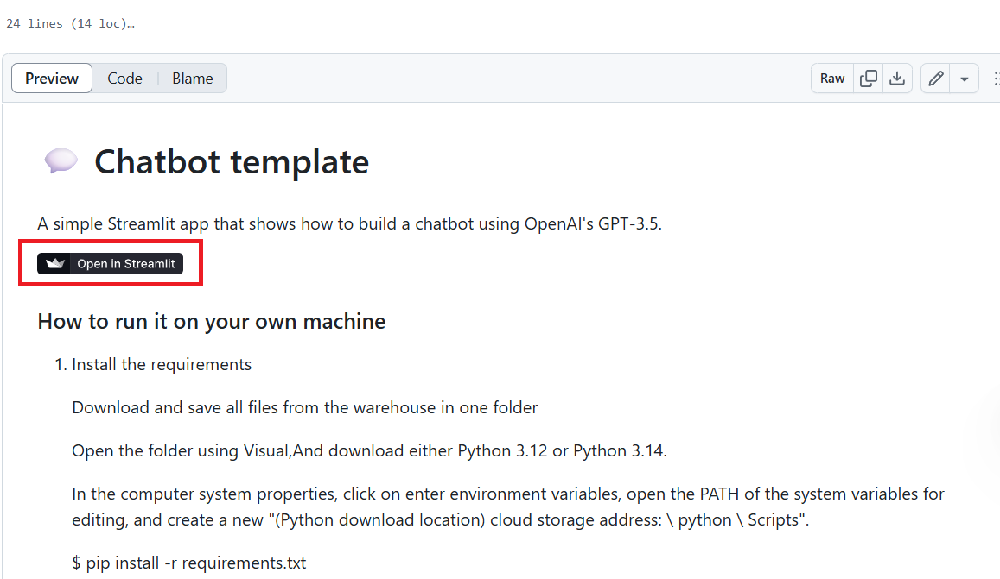
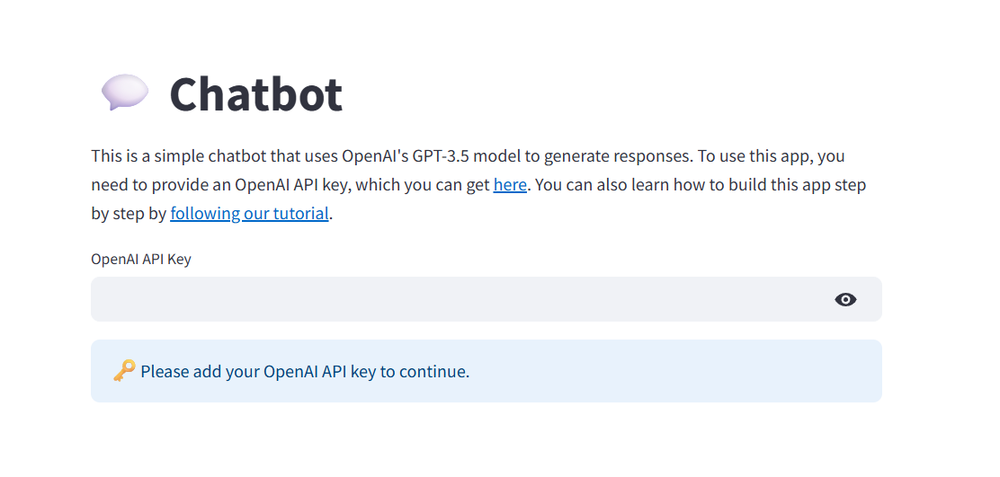

# 💬 Chatbot template

A simple Streamlit app that shows how to build a chatbot using OpenAI's GPT-3.5.

[](https://chatbot-template.streamlit.app/)

### How to run it on your own machine

### Installation Guide

1. **Prerequisites Installation**
- Download all files from the repository and save them in a single folder.
- Open the folder in Visual Studio Code.
- Install either Python 3.12 or Python 3.14.
- (1). Download Python
- &emsp;Visit the Python official website (https://www.python.org/downloads/windows/) download page.
- &emsp;Select the latest version (such as Python 3.12.x), and click Download Windows Installer (64-bit/32-bit).
- &emsp;Run the installer<br>

- (2). Double-click the downloaded .exe file.
- &emsp;Check Add Python to PATH (important! Otherwise, you need to manually configure the environment variables).<br>

- &emsp;Click Install Now (default installation) or customize the installation path.
- &emsp;Check the first and fourth options. The first option is to install to all users. The fourth option is to install environment variables.<br>

- (3). Verify the installation
- &emsp;Open the command prompt (Win + R → enter cmd),Run:
```
python --version
```
- &emsp;If the version number is displayed (such as Python 3.12.0), the installation is successful.

<! -- The above modifications were made through 2205308040320--><br> 


2. **Environment Configuration**
- Navigate to System Properties → Environment Variables.
- Edit the system PATH variable and add a new entry:
```
[Your Python installation path]\Python\Scripts
```
- Configure Visual Studio Code to use the installed Python interpreter.

3. **Dependencies Installation**
- Open Command Prompt (Windows+R → type `cmd`).
- Navigate to your project folder and run:
```
pip install -r requirements.txt
```
- *Note: If you encounter download issues, you may need to use alternative network solutions.*

### Running the Application

1. Launch `streamlit_mapp.py` in Visual Studio Code.
2. Access your chatbot's GitHub repository interface.<br>

3. Enter your pre-set password to start chatting with the chatbot.<br>

   
*Note: Service availability may be limited in certain regions.*
<br>
<! -- The above modifications were made through 2205308040301-->
  
### Detailed Function Description and Implementation Analysis of the Module

## Interface initialization and user guidance

• Interface title and description: Use the st.title() and st.write() functions to display the title and description of the chatbot respectively, and introduce to users that this is a simple chatbot based on the OpenAI GPT-3.5 model, and need to provide O The penAI API key can only be used.

• Get the API key: st.text_input() creates a secure text input box, requiring the user to enter the OpenAI API key, and the input content will be hidden in the form of a password to protect the user‘s key security.
### Code demonstration
```import streamlit as st

# Show title and description
st.title("Chatbot")
st.write(
    "This is a simple chatbot that uses OpenAI's GPT-3.5 model to generate responses. "
    "To use this app, you need to provide an OpenAI API key, which you can get [here](https://platform.openai.com/account/api-keys). "
    "You can also learn how to build this app step by step by [following our tutorial](https://docs.streamlit.io/develop/tutorials/llms/build-conversational-apps)."
)
```
User input verification and interface logic

• API key verification: determine whether the user has entered the API key through the if not openai_api_key: condition. If there is no input, use st.info() to display prompts to tell users that they need to add an API key to continue.

• Chat interface placeholding: If the user provides a valid API key, use the pass statement to reserve the location, indicating that after the user provides the API key, the subsequent chat logic of interaction with OpenAI API has not been implemented and needs to be further developed.
### Code demonstration
```# Request the user to input the OpenAI API key via a text input box
openai_api_key = st.text_input("OpenAI API Key", type="password")
if not openai_api_key:
    st.info("Please add your OpenAI API key to continue.", icon="")
else:
    # If the API key exists, proceed to display the chat interface
    # This is a placeholder for the subsequent chat logic
    pass
```
<! -- The above modifications were made through 2205308040348->


Security Authentication Module

Python


# Dynamic API Key Input Logic openai_api_key = st.text_input("OpenAI API Key", type="password") 

Implementation Logic:

Set input type to “password” to hide plaintext.

Display guide prompt information (icon + text combination) when no key is entered.

It is recommended to use secrets.to to store the key in the production environment.

Security Features:
Dynamic Input of API Key: Users can dynamically input API keys through the interface. 

Key encryption storage: Keys should not be stored in plain text. They should be stored in an encrypted form to enhance security. 

Key display and hiding: When inputting, the key content should be hidden to prevent others from peeping. 

When the user has not entered the key, display the guiding prompt information to help the user complete the operation. 

Realization logic 

Dynamic input of API key: 

python

import streamlit as st
# Dynamic input logic for API key
api_key = st.text_input("OpenAI API Key", type="password") 

Use the `text_input` function of Streamlit to create a password input box where users can enter their API keys. 

The "type="password"" parameter ensures that the entered content is displayed in ciphertext form, enhancing security. 

Key encryption storage: 

It is recommended to use the secrets module to store and manage keys. The secrets module is a built-in module in Python, specifically designed for handling sensitive information such as passwords and keys. 

python


```python
import secrets

# Generate an encrypted key
encrypted_api_key = secrets.token_urlsafe(16)

# Store the encrypted key (This is just an example. The actual storage method should be determined based on the security requirements of the production environment)
# Do not print or expose the key directly in a real scenario
print("Encrypted API Key:", encrypted_api_key)
``` 

Key Hide/Show: 

It has been achieved through type="password", and the content in the input box will be displayed in ciphertext. 

Key Hide/Show: 

It has been achieved through type="password", and the content in the input box will be displayed in ciphertext. 

Guiding prompt information: 

When the user has not entered the key, display the guidance prompt message and icon. 

python


if not api_key:
    st.warning('Please enter your OpenAI API key to continue.')
st.image('path_to_icon.png')  # Replace with the actual path to the icon 


Production environment 


In the production environment, use secrets.to to store keys to ensure the security and privacy of the keys.


<! -- The above modifications were made through 2205308040328->


# English explanation

Session State Check: The if statement verifies whether a key named "messages" already exists in the persistent storage provided by Streamlit's session_state system.
State Initialization: When no existing "messages" entry is found, a new empty list ([]) is created and assigned to st.session_state.messages, effectively initializing the conversation history container.
Persistence Across Interactions: By using session_state, this message history persists across multiple user interactions within the same browser session, enabling features like chat applications or multi-step forms.


# Core Mechanism

State Synchronization: Leverages Streamlit’s reactive programming model to automatically synchronize session states (e.g., user inputs, UI interactions).
Message History Storage: Uses a list-based structure to store conversation data, with each entry containing role (e.g., "user"/"assistant") and content metadata for contextual awareness.
Persistence Across Refreshes: Relies on Streamlit’s st.session_state for in-memory persistence, ensuring continuous access to conversation history even after page reloads.

# Key Design Choices

Reactive Programming: Streamlit’s declarative framework inherently manages state updates (e.g., form inputs, button clicks) without manual intervention.
Structured Data: The messages list in st.session_state enforces a schema (role + content) for scalable message handling.
Client-Side Persistence: Avoids server-side storage by leveraging browser-based session states, simplifying deployment while retaining conversational context.

