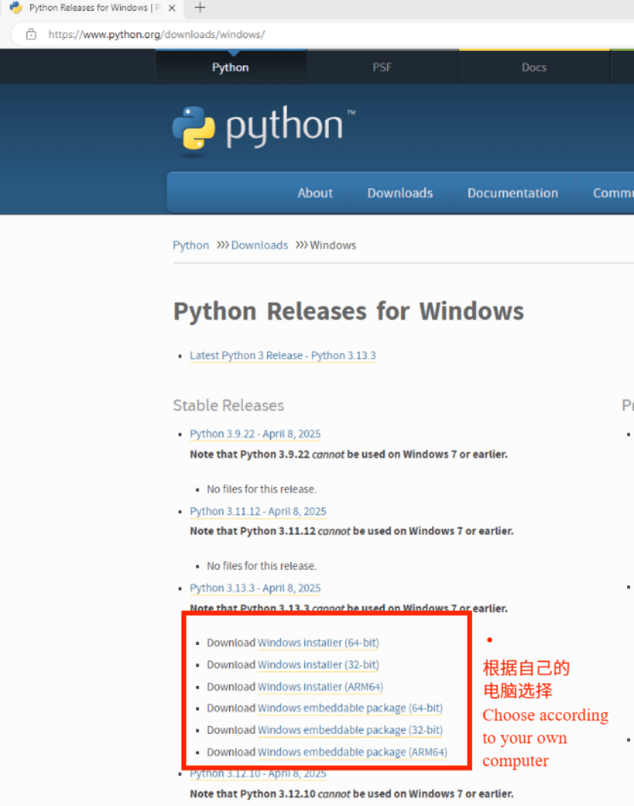
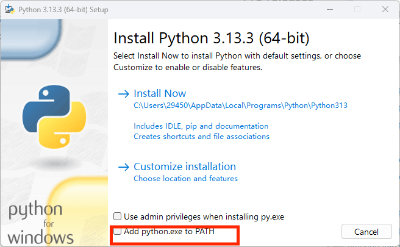
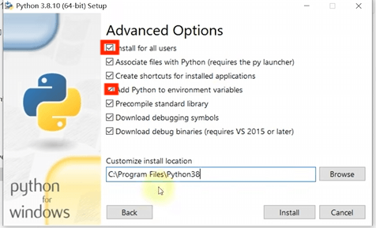

# 💬 聊天机器人模板

一个简单的 Streamlit 应用，展示了如何使用 OpenAI 的 GPT-3.5 构建聊天机器人。

[](https://chatbot-template.streamlit.app/)

### 如何在您自己的机器上运行

### 安装指南

1. **先决条件安装**
- 从代码库下载所有文件并将它们保存在一个文件夹中。
- 在 Visual Studio Code 中打开该文件夹。
- 安装 Python 3.12 或 Python 3.14。
- (1). 下载 Python
- 访问 Python 官方网站 (https://www.python.org/downloads/windows/) 下载页面。
- &emsp;选择最新版本（例如 Python 3.12.x），然后点击“下载 Windows 安装程序（64 位/32 位）”。
- &emsp;运行安装程序<br>

- (2). 双击下载的 .exe 文件。
- &emsp;勾选“将 Python 添加到 PATH”（重要！否则，您需要手动配置环境变量）。<br>

- &emsp;点击“立即安装”（默认安装）或自定义安装路径。
- &emsp;勾选第一和第四个选项。第一个选项是安装到所有用户。第四个选项是安装环境变量。<br>

- (3).验证安装
- &emsp;打开命令提示符（Win + R → 输入 cmd），运行：
```
python --version
```
- &emsp;如果显示版本号（例如 Python 3.12.0），则表示安装成功。

<! -- by 杜俊言 --><br>
